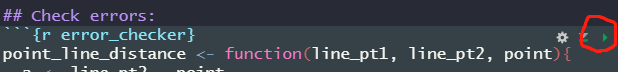

# Astar on CPP

This is a project used on Drone path planning. Followed by a path smoothing module based on Bezier Curve. Dynamic constraints are considered.

### Dependencies:

1. OpenGL Mathematics (glm)

    This is just a mathematical library for 3D objects. I should have replaced it with a more commonly used library such like `Eigen`. If I have time, I will finish the transformation.

  ```bash
  sudo apt-get libglm-dev
  ```

2. Plotly

    In `/dataScripts` there is a ready to use path visualization script written in R language with a 3D ploting library called `Plotly`.This library provides an interactive 3D data visualization result based on JavaScript.

    You can also generate a html version of the visualization making use of `RStudio` and the feature of `Rmd`.

### R language beginner guides:

##### install R and ide:

* **install r**

`sudo apt-get install r-base`

* **install RStudio**

download r studio package

`sudo dpkg -i sudo dpkg -i rstudio*****.deb`

The "****" part is different version number.

* **configurate RStudio**

  1. **change Theme**

    Tools -> Global Options -> Appearance -> Editor Theme

  2. **auto completion**

    Tools -> Global Options -> Code -> completion

    Set `Completion Delay` to 1 chr and 0 ms

  3. **change CRAN source** (increase the package download speed)

    Tools -> Global Options -> Packages -> Primary CRAN repository

    Change the repository to a server near you. (shanghai tongji is the nearest mirror, USTC mirror is the most stable one)

##### play with my script

My script is a Rmd script. It is just like a markdown script but it supports r language code blocks and you can `click the little triangle` on the `right upper` corner of each code block to run that chunk of code.


* Dependency:
dependencies include following packages: `tidyverse` and `plotly`. To install them:
``` java
install.packages("tidyverse")
install.packages("plotly")
```
Then, run all of the chunks should be find.
`ctrl+alt+r` runs all.
